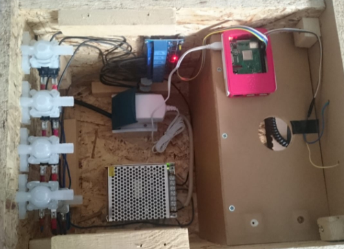
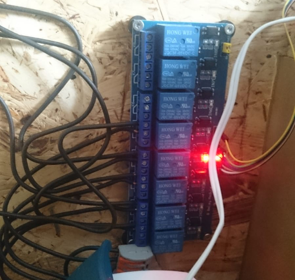
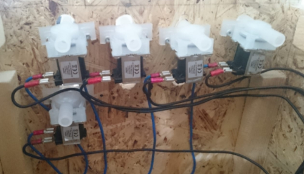

# Cocktailmixer 

Das Ziel von diesem Projekt ist es eine Cocktailmixer zu bauen,
an dem per Knopfdruck ein Cocktail bestellt werden kann.
Dieser Cocktail soll dann in einem Glas zubereitet werden.

# Vorbereitung
In der Vorbereitung wurden sich vergleichbare Projekte angeschaut, um eine Idee dafür zu bekommen,
worauf man bei diesem Vorhaben achten muss. Die Idee das Gehäuse aus Holz zu bauen,
bestand von Anfang an, da es sehr leicht damit möglich ist. Bei den Ventilen wurde darauf geachtet,
dass diese im Stromlosen zustand geschlossen sind, damit bei einem Stromausfall, oder anderen
Störungen nicht viel passieren kann und vor allem nichts ausläuft.

# Bau
Die Maße des Cocktailmixers waren durch den späteren Betriebsort vorgegeben.
Der Cocktailmixer sollte in einem Regal stehen. Dadurch waren die Breite (33cm), Höhe (33 cm) und
die Tiefe (39 cm) festgelegt. Da das Regal nicht direkt an der Wand steht konnten die Kanister
mit den Flüssigkeiten oben auf dem Regal stehen und die Schläuche hinten an dem Regal entlang gehen.
Für dem Bau wurden keine besonderen Werkzeuge benutzt. Es wurde eine Stichsäge zum zuschneiden der
Holzstücke benutzt. Zusätzlich wurde ein Akkuschrauber mit einem Bohraufsatz und ein Paar Schauben
sowie Heißkleber benutzt.

# Elektronik
Da sowohl der Raspberry Pi als auch die Spannungsversorgung Strom brauchten, wurde eine Steckdose
in dem Cocktailmixer installiert. An dieser Steckdose ist der Raspberry Pi angeschlossen.
Die Spannungsversorgung für die Relais wurde direkt mit der Steckdose verkabelt. Damit die
Verkabelung übersichtlicher aus sieht, geht eine Stromführende Ader von der Spannungsversorgung
zu einer Wago Klemme an den Relais. Von dort aus werden alle einzelnen Relais mit Strom versorgt.

## Relais
Die Relais haben die Möglichkeit als Schließer oder Öffner angeschlossen zu werden. Da die
Ventile ohne Stromzufuhr geschlossen sind, mussten die Relais als Schließer benutzt werden.
Die Relais werden auch an dem Raspberry Pi an den GPIO Pins angeschlossen. Es wird für jedes
Relais was benutzt werden soll ein Kabel benötigt, sowie für die Spannung und den Rückleiter
jeweils ein Kabel. 

## Ventile
Die Adern, die zu den Ventilen führen, wurden mit Kabelschuhen versehen und damit an den
Ventilen angesteckt. Es wurde sich dafür entschieden, da es wesentlich schneller ging
als die einzelnen Adern zu verlöten und da die Kabelschuhe sehr gut an die Anschlüsse
der Ventile gepasst haben.

## Knöpfe
Da im späteren Verlauf des Projektes festgestellt wurde, das es ein kleines Problem mit
den Knöpfen gab, wurden ein Knopf zu bestätigen der Bestellung und jeweils ein Knopf
für den entsprechenden Cocktail angebracht. Alle Knöpfe sind auch mit dem Raspberry Pi
über die GPIO Pins verbunden.

# GPIO
Ein Raspberry Pi hab bis zu 40 GPIO Pins. Diese können für viele verschiedene Sachen benutzt werden.
Es gibt einige Pinne, die eine Feste Belegung haben, daher z.B. über Spannung verfügen.

Hier ist aufgeführt, welche Eigenschaften die einzelne Pinne haben:

Quelle: [elektronik kompendium](https://www.elektronik-kompendium.de/sites/raspberry-pi/1907101.htm)

# Programmierung
Für den Programmcode wurde ein Python Script geschrieben. Es wurde sich dabei an die
[Anleitung](http://raspberrypiguide.de/howtos/raspberry-pi-gpio-how-to/)
von der Webseite raspberrypiguide.de gehalten. Dort wir erklärt wie man einen Pin abfragen kann
oder auch ein Befehl über einen Pin schicken kann.

Das Fertige Script ist in der Datei [mixer.py](mixer.py)

Ein Hilfreiches Video ist außerdem:

## Pulldown Wiederstand
Bei dem Testen des Programme ist aufgefallen, dass der Raspberry Pi troz nicht betätigen des
Knopfes eine Signal bekommt. Die kann durch die Verwendung des PullDown Wiederstandes verhindert
werden.

Quelle: 

# Script beim Booten starten
Damit nach dem starten des Raspberry Pi das Script automatisch gestartet wird und nicht
manuell gestartet werden muss, wird in der Autostart Datei ein Eintrag hinzugefügt.

Der Pfad zu der datei lautet: `/etc/rc.local`

Nun muss das Script aufgerufen werden. Das geschieht mit dem Eintrag des folgenden Befehles:
python /home/pi/test.py &`

Dies muss vor der der Zeile mit dem Befehl `exit 0` geschehen.

Das `&` am Ende der Zeile ist wichtig, damit der Raspberry Pi das Script im Hintergrund ausführt
und nicht an dieser Stelle beim Booten hängen bleibt.

Quelle: [webnist.de](https://webnist.de/python-script-auf-dem-raspberry-pi-automatisch-starten/)

# Mitwirkende
Dieses Projekt wurde erstellt von:
- [Maximilian Kosowski (Assassinee)](https://github.com/Assassinee)
- [Lars Quiehl (Latanyor)](https://github.com/Latanyor)

# Erweiterungen
- Eine Mögliche Erweiterung wäre ein LCD Display anzubringen, damit einem Der Aktuelle Status
angezeigt werden kann.

- Eine Weiter Erweiterung wäre es, ein Webinterface zu erstellen um sich einen Cocktail bestellen
zu können.